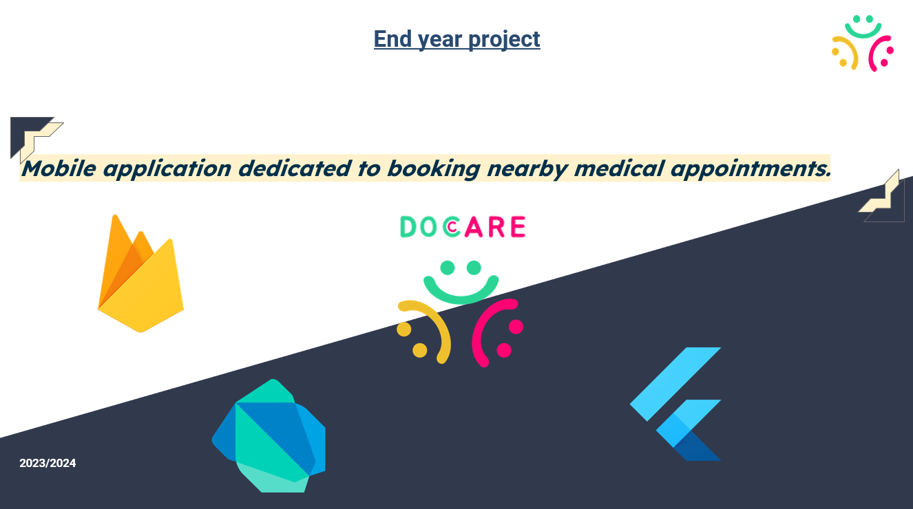
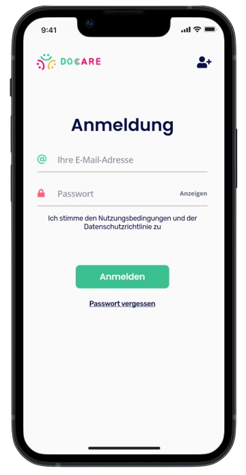
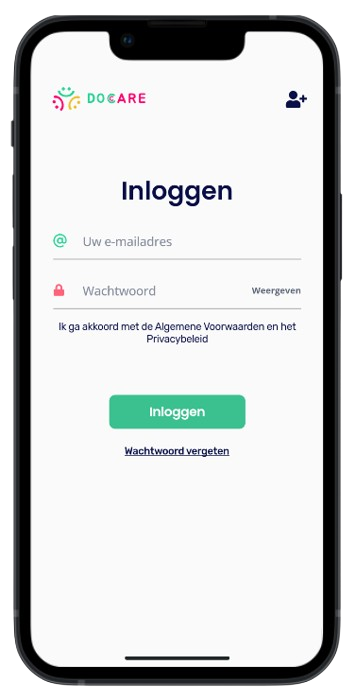
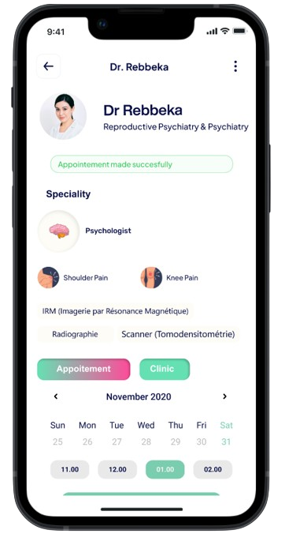
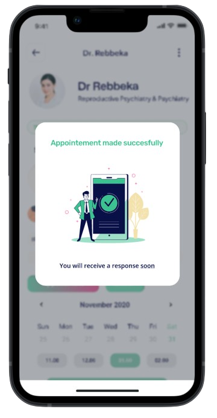
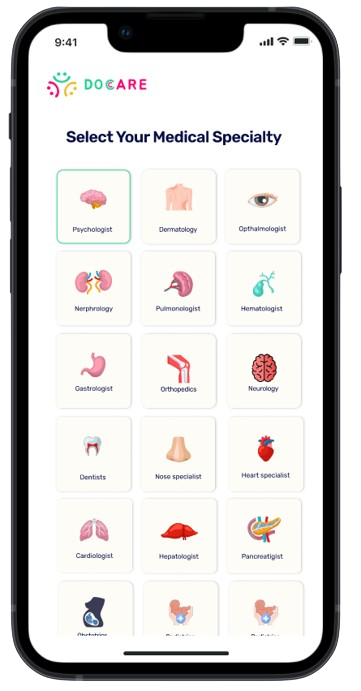
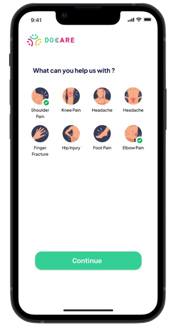

# DoCare

🚀 Excited to Announce: DoCare - My End-of-Year Project! 🚀

I am thrilled to share that I have successfully completed my end-of-year project, "DoCare," a mobile application dedicated to simplifying the process of booking medical appointments with nearby doctors. Built using Flutter and Firebase, DoCare leverages the latest technology to provide a seamless and efficient user experience.

## Key Features
- **Multi-Platform Compatibility**: Developed with Flutter, ensuring availability on both iOS and Android.
- **Real-Time Data Synchronization**: Utilized Firebase Firestore for real-time data management, providing instant updates to users.
- **Multi-Language Support**: Supports multiple languages, making it accessible to a diverse user base.
- **User-Friendly Interface**: Designed with an intuitive UI to ensure ease of use for everyone.
- **Enhanced Security**: Implemented advanced security protocols to protect user data, complying with GDPR and HIPAA regulations.
- **Flexible Location Management**: Offers multiple ways to set locations, including automatic suggestions, current location use, and manual selection on a map.

## Screenshots

### Main Interface

### Features Overview
Here are some screenshots of the actual application:

<table>
  <tr>
    <td></td>
    <td></td>
    <td></td>
  </tr>
  <tr>
    <td></td>
    <td></td>
    <td></td>
  </tr>
</table>

## Technologies Used
- **Flutter**: A UI toolkit for building natively compiled applications for mobile, web, and desktop from a single codebase.
- **Firebase**: A platform developed by Google for creating mobile and web applications, providing a real-time database, authentication, and cloud functions.

## Future Enhancements
- **Online Consultations**: Adding functionality for video consultations with doctors.
- **Payment Integration**: Introducing electronic payment methods for easy and secure transactions.
- **Reminder Notifications**: Implementing reminder notifications for upcoming appointments.
- **Emergency Button**: Adding an emergency button for quick access to medical help.

## Contact
For more information, feel free to reach out to me via email at: samirbena6000@gmail.com

## Acknowledgments
I would like to thank my supervisor, M. SI Tayeb, for his invaluable guidance, and my co-presenter Wissam Azrine, for their collaboration throughout this journey.

